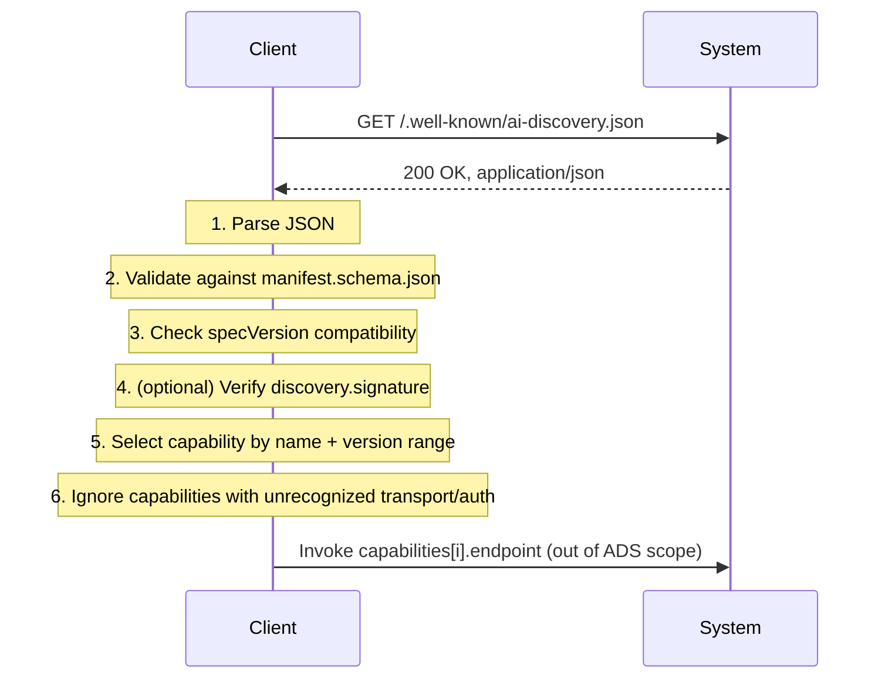

# ADS Core — 03. Discovery Flow

Normative. This document defines how a client goes from "I have an entry
point" (a URL, a domain, a local path) to "I have a validated manifest I can
act on."

## Discovery mechanisms

A system MAY support more than one of these; a client SHOULD try them in the
order listed for its context, falling back to the next on failure.

### 1. HTTP well-known URI (primary mechanism)

For any HTTP(S)-addressable system, the manifest **MUST** be available at:

```text
GET https://{host}/.well-known/ai-discovery.json
```

Requirements:

- Response **MUST** be served with `Content-Type: application/json` (or a
  `+json` structured suffix).
- Response **MUST** be valid JSON conforming to
  [schema/manifest.schema.json](schema/manifest.schema.json).
- Server **SHOULD** support standard HTTP caching (`ETag`, `Cache-Control`,
  `If-None-Match`) in addition to, or instead of, `discovery.cacheTtlSeconds`.
- Server **SHOULD** respond to `HEAD` for lightweight freshness checks.
- CORS: if the manifest is meant to be discoverable from browser-based
  clients, the server **SHOULD** send `Access-Control-Allow-Origin: *` — a
  manifest is a public discovery document, not a protected resource.

This is the mechanism most implementations need and the only one Core
conformance requires supporting as a *server*. Clients **MUST** support
this mechanism; supporting the others below is optional for a client.

### 2. DNS TXT record (pre-connection discovery)

For discovering a manifest location before making an HTTP connection (e.g.
agent-to-agent discovery given only a domain name):

```text
_ai-discovery.{domain}.  IN  TXT  "ads=https://example.com/.well-known/ai-discovery.json"
```

The `ads=` key's value is the manifest URL to fetch via mechanism 1. This
record is a pointer, not the manifest itself — TXT record size limits make
embedding the manifest directly impractical.

### 3. Inline/local discovery (offline and embedded contexts)

For systems without a network address at discovery time (a CLI tool, a
library, an embedded agent config), a manifest **MAY** be a plain file
conventionally named `ai-discovery.json` at a location relevant to that
context (e.g. a project root). This document doesn't standardize *where*
inline manifests live beyond the filename convention — that's inherently
context-specific — but the manifest content itself follows the same schema.

## Resolution and validation flow



Step by step, normatively:

1. **Fetch.** Client requests the manifest via one of the mechanisms above.
2. **Parse.** If the response isn't valid JSON, discovery fails — the
   client MUST NOT attempt partial recovery (e.g. regex-scraping fields out
   of malformed JSON).
3. **Validate.** Client checks the document against
   [schema/manifest.schema.json](schema/manifest.schema.json). A document
   missing a required Core field is not a valid manifest, full stop —
   partial manifests are a client-side contradiction in terms.
4. **Version check.** Client compares `specVersion` against what it
   supports (see [04-versioning-strategy.md](04-versioning-strategy.md)). An
   unrecognized MAJOR **MUST** cause the client to stop and report
   incompatibility rather than guess.
5. **Integrity check (optional).** If `discovery.signature` is present and
   the client cares about integrity (e.g. it fetched the manifest over a
   channel it doesn't fully trust, or is caching it long-term), it SHOULD
   verify the signature against the key at `signature.keyUrl` before
   trusting the content. Absence of a signature is not itself an error —
   plenty of legitimate discovery happens over channels (direct HTTPS to a
   known host) where transport security already covers this.
6. **Capability selection.** Client picks the `capabilities[]` entries it
   needs by `name`, checks `version` against its required range, and skips
   (not errors on) any capability whose `endpoint.transport` or `.auth` it
   doesn't recognize.
7. **Invoke.** Out of scope for ADS — governed by whatever `endpoint`
   points at.

## Manifest integrity

The `discovery.signature` block (see
[02-manifest-schema.md](02-manifest-schema.md#discovery)) lets a system
cryptographically sign its manifest so a client that received it through an
untrusted intermediary (a cache, a registry mirror, a forwarded copy) can
still verify it hasn't been tampered with. This is deliberately optional and
deliberately minimal (`algorithm` + `value` + `keyUrl`) — ADS Core doesn't
mandate a PKI or a specific signing scheme; if you need one standardized,
propose it as an extension (see
[05-extensibility.md](05-extensibility.md)).

When present, `signature.value` is computed over the manifest document with
the `discovery.signature` field itself removed (you can't sign a document
that includes its own signature). Verifiers fetch the public key from
`signature.keyUrl` — key rotation and trust-on-first-use policy are
implementation concerns, not specified here.

## Caching and refresh

- If `discovery.cacheTtlSeconds` is present, a client MAY treat the manifest
  as fresh for that many seconds without revalidating.
- If absent, a client SHOULD rely on standard HTTP caching semantics
  (`Cache-Control`, `ETag`) where the transport provides them, and
  otherwise SHOULD revalidate on every use that matters (i.e. don't cache
  indefinitely by default).
- A client MUST be able to handle the manifest changing between fetches —
  capabilities appearing, disappearing, or changing version. Treating a
  manifest as permanent, immutable truth is a client bug.

## Error handling

| Situation | Client behavior |
|---|---|
| `404` on the well-known path | System does not support ADS discovery. Not an error condition for the client to alarm on — just "unsupported." |
| Malformed JSON | Discovery fails. Do not attempt partial parsing. |
| Valid JSON, fails schema validation | Discovery fails. Do not attempt to use partial/best-guess fields. |
| Valid manifest, unrecognized `specVersion` MAJOR | Discovery fails with a clear "incompatible version" signal, not a silent no-op. |
| Valid manifest, some capabilities have unrecognized `transport`/`auth` | Discovery succeeds; those specific capabilities are simply unusable to this client. |
| Signature present but verification fails | Client-defined policy — Core does not mandate hard-fail, but a client that chooses to proceed anyway SHOULD make that a deliberate, loggable decision, not a silent ignore. |
